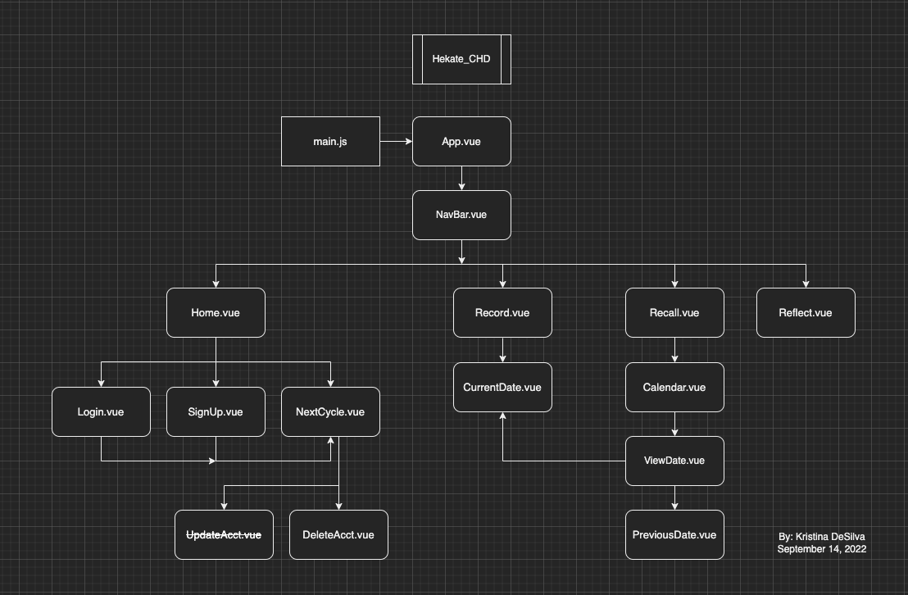
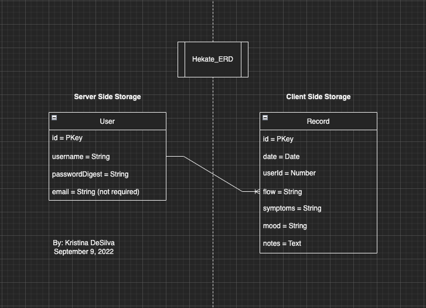

# Hekate

### By: [Kristina DeSilva](https:github.com/kavdesilva)
### Date: 9/1/2022

---

### _Description_

#### A period tracker web application that keeps your data secure. Named after Hekate, ancient Greek goddess of the Moon. Often depicted holding a key or a torch, Hekate is associated with crossroads and liminal spaces; she is also considered a protector of knowledge.

___

### [Hekate Link]()

---

### _Languages_

- Vue.js
- Express
- Node.js
- Postgresql/Sequelize

---

### _Trello Board_

#### [Capstone Project - Hekate Period Tracker App](https://trello.com/b/dwYRZXGW/hekate-period-tracker-app)

---

### _Component Heirarchy Diagram (CHD)_

---

### _Entity Relationship Diagram (ERD)_

---

### _Wireframes_

#### Page

---

### _Future Updates_

- [x] README.md
- [x] Trello Board
- [x] ERD
- [x] CHD
- [x] IndexedDB Client-Side Storage
- [ ] Heroku Deployment
- [ ] LocalDB Token Auth

### _Post-MVP_

- [ ] Encryption of Client-Side/Server-Side DBs
- [ ] Algorithms for Cycle Patterns
- [ ] Responsive Layout for Mobile

---

### _Credits_

#### [localbase - Github](https://github.com/dannyconnell/localbase)
#### [Vuepic Datepicker - Github](https://github.com/Vuepic/vue-datepicker)
#### [Vice - 'The Strange Sexism of Period Apps,' by Miranda Hall](https://www.vice.com/en/article/qvp5yd/the-strange-sexism-of-period-apps)
